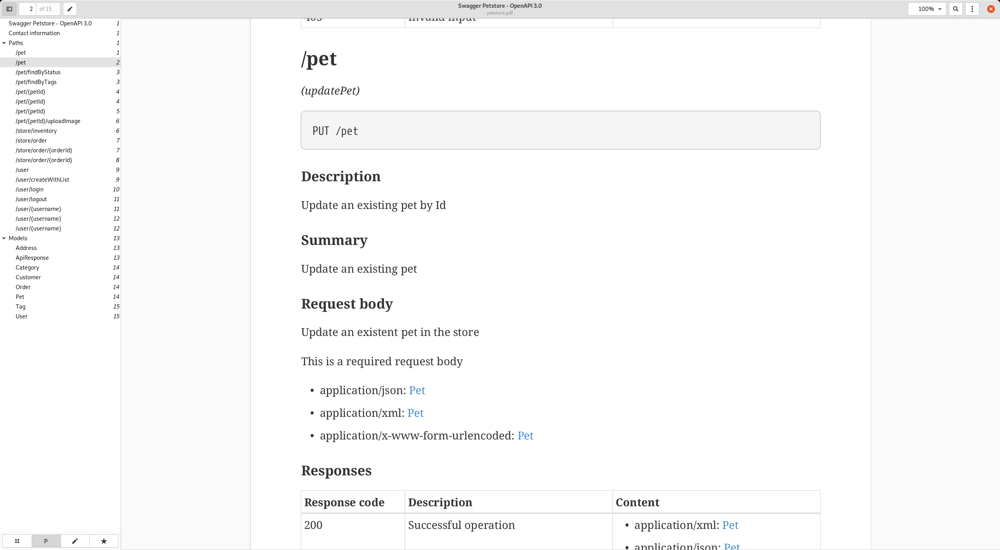

# ApiDoc

I was missing a simple tool that can convert an OpenAPI 3 JSON file to a nice looking document. Since I like AsciiDoc I decided to output it to that format.

## Example

If you download the OpenAPI petstore exmaple and convert it to AsciiDoc using this tool you get the following:

## Requirements

Minimal requirements:

* Java 11 or higher
* Maven 3.8.* or higher

## Building the application

Run:

    mvn clean install

This will create an executable JAR in `app/target/apidoc-app-0.1.jar`

## Running the application

After compiling you can run:

    java -jar app/target/apidoc-app-0.1.jar

### Convert multiple API JSON files

The application can convert multiple JSON files in one go by speficying one output and multiple input files.

    java -jar apidoc-app-0.1.jar --output=~/Downloads data/example1.json data/example2.json data/example3.json data/example4.json

This will create: `exampl1.adoc`, `exampl2.adoc`, `exampl3.adoc` and `exampl4.adoc` in `~/Downloads`

## What does this tool convert?

The following models from OpenAPI are being converted to AsciiDoc:

* Info
  * Title
  * Description
  * Version
  * Contact information
* Paths (sorted!)
  * Per path the operations if they are present in the order:
    * delete
    * get
    * head
    * options
    * patch
    * post
    * put
    * trace
* Per operation:
  * the current path
  * the call (method and path)
  * If the method is deprecated (warning)
  * Description
  * Summary
  * RequestBody
    * Description
    * If the body is required
    * Shows object references per media type
  * Parameters
    * Lists type,name,description,schema and default
    * Also adds examples in the default column
  * Responses
    * Shows object references per media type
    * Currently does not list anonymous types

The following stuff is not (yet?) handled:
  * External examples
  * Headers
  * Security
  * Servers
  * Tags